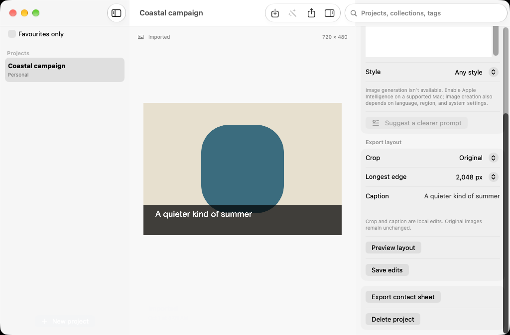

# Image Workshop

A native macOS 27 workspace for creating artwork with Apple Image Playground, preserving accepted versions, and preparing images for export.

[](https://github.com/DawoodAamir/Image-Workshop/actions/workflows/ci.yml)



Screenshot captured by the native workflow test using an original fixture illustration.

## What you can do

- Organise artwork into named projects, collections, tags, and favourites.
- Seed Apple's image-creation sheet with a prompt and the selected artwork as visual inspiration. Request square, portrait, or landscape output and choose supported styles.
- Ask the on-device Foundation Models model for clearer prompt wording, review the suggestion, or cancel it.
- Keep accepted image versions and their brief; compare the selected version with its predecessor.
- Preview non-destructive crop and caption layouts, export PNG/JPEG up to 4096 pixels on the longest edge, and export a PDF contact sheet.
- Import images and use the local workspace even when Apple Intelligence is unavailable.

## Run

Open **Image Workshop.xcodeproj** in Xcode 27 and run **Image Workshop → My Mac**. The app targets macOS 27 and uses bundle ID `com.dd.imageworkshop`. No personal signing team, App Store identity, credentials, or third-party packages are included.

Create a project, import a PNG/JPEG/HEIF image, edit its name and caption in the inspector, and choose Save edits. Use Preview layout to try a crop without changing the original. Create image opens Apple's system sheet when image generation is available.

Image Playground's latest model runs on Private Cloud Compute. It requires supported Apple Intelligence hardware, appropriate system settings, supported language/region, and cloud connectivity. Apple controls generation availability and usage limits. This app does not opt into external image providers. It uses the supported sheet rather than the deprecated non-UI ImageCreator API. Requested dimensions map to Apple's supported resolutions; the workspace reports the accepted image dimensions. It does not offer unattended generation or custom inpainting.

Prompt assistance is a separate on-device Foundation Models feature. Suggestions are optional and editable, never automatically substituted. Import, local editing, and export need no model.

## Design and architecture

The workspace follows [Apple's macOS design guidance](https://developer.apple.com/design/human-interface-guidelines/designing-for-macos): a resizable split-view sidebar, native toolbar and inspector, system typography, keyboard navigation, Command-N, and standard import/export panels. Colour is limited to semantic controls and original artwork. Image previews have accessibility labels; captions and names are ordinary editable text.

Swift 6 strict concurrency is enabled. SwiftData models stay on the main actor; an asset actor owns immutable original files, thumbnails, rendering, and exports. Streamed prompt suggestions and previews are cancellable and reject stale results. Model save failures roll back metadata and retain the library rather than silently resetting it.

- `Sources/App`: SwiftData models, native workspace, and prompt assistance.
- `Sources/Core`: validated export recipes, bounded image decoding, immutable asset storage, and renderer.
- `Tests/Core`: Swift Testing regression coverage for crop geometry, validation, asset isolation, PNG rendering, and PDF output.
- `Tests/UI`: native file-picker, edit, favourite, and persistence workflow.
- `Scripts/GenerateIcon.swift`: original reproducible app icon.

Imports are limited to 25 MB and 50 megapixels. Previews are bounded to 1600 pixels. Layout rendering uses bounded ImageIO decode and Core Graphics; exports larger than the source may upscale it. Captions are limited to 160 characters. Contact sheets show image versions, without claiming generated labels or print colour calibration.

## Verification

```sh
swift test
swift test -c release
bash Scripts/test-ui.sh
```

CI uses GitHub's Xcode 27/macOS 27 runner, compiles a Release app, runs core tests, and runs the native workflow. Test attachments are retained as artifacts. See [verification notes](Docs/Verification.md) for actual results and device checks.

Apple's cloud generation and an on-device prompt response require suitable hardware and enabled models. Build and ordinary editing tests are not proof that those services have been exercised. Before distribution, verify both available/unavailable states, image creation/cancellation, generation limits, VoiceOver, contrast settings, and keyboard-only use on a supported Mac.

## Data and contribution

Projects and accepted image files remain in the app's sandbox. No analytics or application-operated backend. Read [PRIVACY.md](PRIVACY.md), [CONTRIBUTING.md](CONTRIBUTING.md), and the [MIT license](LICENSE).

Apple API references: [Image Playground WWDC26](https://developer.apple.com/videos/play/wwdc2026/375/), [ImageCreator deprecation](https://developer.apple.com/news/?id=dz9wvq0r), [Foundation Models](https://developer.apple.com/documentation/foundationmodels).
